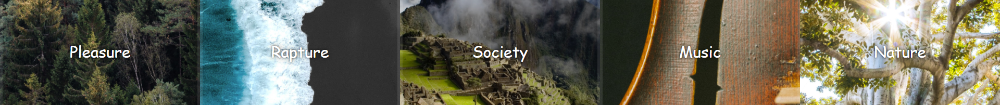

# Flex-Gallery

Image gallery created with CSS and JavaScript. 
The divs use flex to distribute themselves evenly. Upon clicking in a div, JavaScript toggles the 'open' class (increases font-size and flex-size). Once this transition ended, another function toggles the 'active' class, which hides/shows the first and last child of the div.

Quote: Lord Byron

Images used:
- Woods: [Artem Sapegin](https://unsplash.com/photos/ySnXFQ98qrE)
- Shore: [Sacha Styles](https://unsplash.com/photos/XK7thML3zEQ)
- Society: [Amanda Kerr](https://unsplash.com/photos/jpMyAqHat7g)
- Music: [Johanna Vogt](https://unsplash.com/photos/H7kVzJgum3M)
- Nature: [Jeremy Bishop](https://unsplash.com/photos/EwKXn5CapA4)

